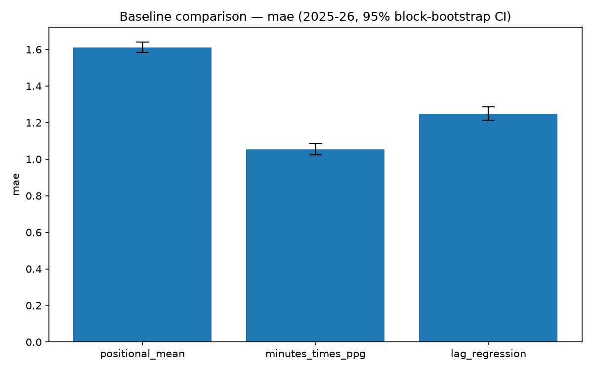

# v1 performance

Running report for the expected-points model (`tools/fpl_xp_model_spec_v1.1.md`). Prose is hand-authored; every number below is copied from a generated report, never typed by hand. M3 adds the harness and the three baselines. M4 onward will append the model's own numbers to the tables here as each component ships.

## Backtest harness

`fpl/evaluate.py` walks 2025-26 forward gameweek by gameweek. At each gameweek's earliest kickoff, every candidate predicts from a frame holding only rows with an earlier kickoff, and the prediction is scored against what the player actually did that gameweek. A player with no fixture that gameweek is simply absent from the scored rows, so a blank is never counted as a missed prediction of zero. Full methodology and per-metric detail: `1.4-backtest-baselines.md`.

## Baselines

Three honest challengers, not straw men: the positional mean (the floor), predicted minutes times season-to-date points per 90 (the bar the spec expects to be hard to beat), and an OLS regression on the player's own last three gameweeks, refit each week and trained on 2025-26 only.

| baseline | mae | rmse | spearman_60plus | captain_regret | top_10_overlap | top_30_overlap | minutes_share | rate_share |
|---|---|---|---|---|---|---|---|---|
| positional_mean | 1.61 | 2.382 | 0.32 | -16.474 | 0.018 | 0.059 |  |  |
| minutes_times_ppg | 1.053 | 2.145 | 0.079 | -11.0 | 0.097 | 0.161 | 0.397 | 0.603 |
| lag_regression | 1.249 | 2.105 | 0.064 | -12.368 | 0.082 | 0.161 |  |  |

MAE/RMSE are reported for completeness, not as the steering metric — they're dominated by non-starters, which is why the positional mean scores respectably on them despite carrying no player-level information. `minutes_times_ppg` has the lowest MAE and captain regret of the three and the highest top-10 and top-30 overlap, consistent with the spec's expectation that predicted-minutes-times-rate is the hard-to-beat baseline.

`positional_mean`'s `spearman_60plus` is not comparable to the other two. It predicts the same value for every player in a position each gameweek, so within-group rank correlation is undefined everywhere except the rare gameweeks with a double gameweek, where the extra fixture breaks the tie; its reported average of 0.32 is computed over only that small, DGW-selected subset of groups (13 of 152), against 148 and 152 for `minutes_times_ppg` and `lag_regression` respectively. Read at face value it would suggest the positional mean out-ranks both real baselines — it does not; the number measures a different, much narrower thing.

`minutes_share`/`rate_share` are populated only for `minutes_times_ppg`, the one baseline that exposes a separable minutes half and rate half. Holding the rate half at its realised value and varying only the minutes half accounts for 40% of the rank error measured this way, against 60% for the reverse (holding minutes fixed, varying the rate). At the baseline stage the rate half carries more of the error, opposite the direction the spec's working hypothesis expects for the eventual model (S8, M3: everything multiplies through a minutes probability, so ranking is expected to end up dominated by minutes certainty once a real minutes model exists). A naive trailing-mean minutes predictor and a season-to-date points-per-90 rate are not the same quality of model, so this split says more about which half of `minutes_times_ppg` is currently weaker than about the underlying hypothesis; M4's real minutes model is the point at which that hypothesis gets a fair test.

## Model-vs-model comparison

38 gameweeks is a small sample, so every comparison is a block-bootstrap 95% CI over gameweeks, not a point estimate.

| Comparison | Metric | Difference | 95% CI |
|---|---|---|---|
| positional_mean - minutes_times_ppg | MAE | 0.556 | [0.524, 0.591] |
| positional_mean - lag_regression | MAE | 0.360 | [0.323, 0.397] |
| minutes_times_ppg - lag_regression | MAE | -0.196 | [-0.214, -0.177] |

All three CIs exclude zero, so on MAE the three baselines rank distinctly rather than being indistinguishable within noise: `minutes_times_ppg` beats `lag_regression` beats `positional_mean`.

## Live-only features

Two features are known at decision time but cannot be reconstructed for a historical gameweek, so they are excluded from training and the backtest and enter only as an explicit `predict()` argument in the live path (spec S1.4):

1. Injury and availability news.
2. Set-piece and penalty-taker duty (`players_raw.csv` records only an end-of-season snapshot, not a per-gameweek history).

The backtest numbers above are a lower bound on live performance for this reason: the live path has information the backtest structurally cannot.

## Caveats

DefCon has no out-of-sample season. 2025-26 is the only season carrying the scoring column, so once a real defensive-contribution component exists, its validation is out-of-time within one season and nothing more.

The bonus component's eventual backtest evaluates a superseded scoring system. BPS rules changed for 2026-27, so a bonus model's measured 2025-26 performance will not transfer to the live season without a separate check once 2026-27 gameweeks exist in the pinned dataset.

## Next

M4 builds the thin vertical slice (team-fixture model, minutes, attacking returns, crude bonus) and scores it against the three baselines above. If the slice does not beat `minutes_times_ppg`, that is the finding to report before refining any component further.
